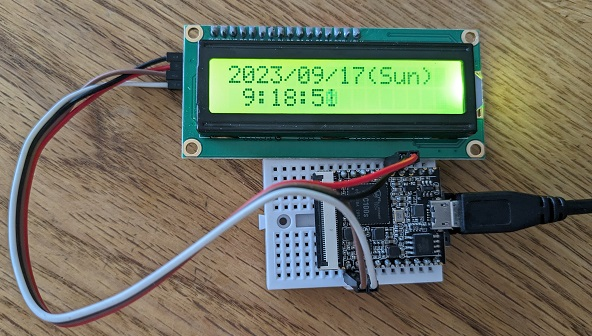

# mainlineカーネルを使用したLichee Pi Nanoブート可能Linuxイメージ

最近F1C100sチップ向けmainlineカーネルの開発が進み、SDカードサイズの極小シングルボードコンピュータLichee Pi Nanoで動作するブート可能イメージを、カスタムコードを必要とせずに作る事に成功しました。

本リポジトリには、イメージの作成に必要なLichee Pi Nano用のBuildroot設定ファイルと、Dockerによる仮想ビルド環境構築設定ファイル、そしてコマンドの起動をまとめたシェルスクリプトなどブート可能イメージ作成に必要なファイル群を全て含めました。これによりほぼ全自動にて起動可能なmicroSDカードイメージを作成可能です。

Linuxカーネル設定でUSBガジェットイーサネット(g_ether)が有効化されており、Lichee Pi NanoをホストPC経由でインターネットに接続させる事が出来ます。つまり、USBケーブル一本でLichee Pi Nanoを極小インターネット端末にすることが出来、sshログインしてデバッグしたり、ネットワークアプリケーションを動作させたりすることが可能になります。

## 必要な物

- Dockerが動作するPC(Linuxホストでのみテスト済。MacやWindowsでは試してません。)
   - ストレージがHDDのシステムだとビルド時間が掛かります。SSD搭載システム推奨。
- 256MB以上のmicroSDカード
- Lichee Pi Nano本体

## ビルド環境のインストール

Linuxホストに環境構築する方法は以下の2ステップ。

1. リポジトリのクローン
```sh
git clone https://github.com/goediy/licheepi-nano-mainline.git
cd licheepi-nano-mainline
```
2. Docker環境の構築
```sh
cd docker/
./00create-docker.sh
```
   もしくは、bashシェル上で、
```sh
cd docker/
docker build -t br-build:latest --build-arg UID=$UID --build-arg USERNAME=$USER -f Dockerfile .
```

## ブート可能なmicroSDの作成方法

SDカードイメージ書き込みも、以下たったの2ステップ。

1. Buildrootのダウンロードとビルド(Dockerコンテナの中で実行されます)
```sh
./download-and-build.sh
```
   もしくは、bashシェル上で、
```sh
docker run --ipc=host --rm -it -v $PWD/:/home/$USER/work br-build /home/$USER/br-build.sh
```
2. SDカードへ書き込み
```sh
dd if=sdcard.img of=/dev/sd?
```

## Lichee Pi Nanoへのログイン方法

ブート可能なmicroSDカードはLichee Pi Nanoに挿して電源を入れれば起動します。デフォルトで設定されているログイン可能なユーザーは下表の通りです。

|ユーザー名|パスワード|
|:--:|:--:|
|root|無し|
|lichee|pi|

UART0からのログインの他、ホストPCからネットワーク越しにlicheeユーザでsshログイン出来ます。

## USBガジェットイーサーネットのネットワーク設定

#### Lichee Pi Nanoのusb0ネットワーク設定

デフォルトでは、USBイーサーネットデバイスusb0のIPアドレスを192.168.10.10/24、nameserverを192.168.1.1に設定しています。お使いのLAN環境に応じて、適宜/etc/network/interfacesや/etc/resolve.confの設定を変更して下さい。

#### ホストPCのネットワーク設定

ホストPC側にusbN(Nは数字)という名前が付いたイーサネットデバイスはLichee Pi Nano側と同じネットワークにIPアドレスを設定する必要があります。また、Lichee Pi Nano側のIPパケットを適切に扱うために、ホストPCにNATの機能を持たせる必要があります。

Linuxホストでの設定手順例を以下に示します。

- Network ManagerでIPアドレスを設定
```sh
nmcli connection add type ethernet ifname usb0 con-name usbeth0
nmcli connection mod usbeth0 ipv4.method manual ipv4.addresses 192.168.10.1/24
sudo nmcli connection up usbeth0
```
- /etc/sysctl.confにIPフォワード設定の行を追加
```
net.ipv4.ip_forward=1
```
- IPフォワードの設定の有効化
```sh
sudo sysctl -p
```
- iptablesでNATを有効化
```sh
sudo iptables -t nat -A POSTROUTING -s 192.168.10.0/24 -o eth0 -j MASQUERADE
sudo iptables -A FORWARD -i eth0 -o usb0 -m state --state RELATED,ESTABLISHED -j ACCEPT
sudo iptables -A FORWARD -i usb0 -o eth0 -j ACCEPT
```
- iptables設定の永続化
```sh
sudo /sbin/iptables-save > /etc/iptables/rules.v4
```

## Buildrootカスタマイズの手順

パッケージ追加などのカスタマイズを行うためには、上記download-and-build.shを1回以上実行しBuildrootパッケージが展開されている状態にて、Dockerコンテナの中で作業を行います。

1. Dockerコンテナの起動
```sh
./start-docker.sh
```
   もしくは、bashシェル上で、
```sh
docker run --ipc=host --rm -it -v $PWD/:/home/$USER/work br-build /usr/bin/bash
```
2. (Dockerコンテナの中で)Buildrootカスタマイズとビルド実行
```sh
cd work/buildroot-2023.02.4
make menuconfig
make
```

Buildrootカスタマイズ方法について私のブログに記事があり、ひょっとしたら参考になるかもしれません。

https://blog.goediy.com/?p=1562

## swapの有効化

F1C100s内蔵RAMは32MBと小さく、少しでも多くのメモリ空間を確保するためにはmicroSDのストレージ領域をswapとして使う方法があります。swapを有効化するには、Lichee Pi Nanoにログインし一回だけ以下のコマンドを実行します。(要root権限)
```sh
sudo mkswap /dev/mmcblk0p3
```

## Pythonサンプルプログラムの実行

I2C接続の1602ディスプレイにシステム時刻を表示するだけの簡単な物です。動かし方など詳細はLichee Pi Nanoのファイルシステム/opt/example/readme.txtを参照して下さい。ネットワーク設定を適切に行えばLichee Pi Nanoのシステムクロックがchronyでインターネットのタイムサーバと同期され、正確な時刻が表示される筈です。



## 各種バージョンについて

以下の表の通りです。

|Buildroot|Linux|U-Boot|
|:--:|:--:|:--:|
|2023.02.4|6.4.16|2023.07.02|

Buildroot2023.02のデフォルトではLinuxバージョン6.1系を使う設定ですが、[F1C100sのUSB正式対応がバージョン6.4〜](https://linux-sunxi.org/Linux_mainlining_effort)となっており、6.4系のEOL版である6.4.16を指定しております。

U-Bootに関してもBuildrootデフォルト指定バージョン2022.04はF1C100s未対応のため、2023.07.02を指定しております。

## 参考にしたプロジェクト

カラー液晶ディスプレイが動作するなど魅力的なフィーチャーを備えた実用的なイメージが作成出来、一時期私自身も使わせて頂いていました。Buildroot外部設定ファイルの作り方など幾つか参考にさせて頂いた内容があります。

https://github.com/unframework/licheepi-nano-buildroot

## ToDo項目

- I2C、GPIOとUSBガジェットイーサーネットとUSBホスト動作は基本的に問題無さそうです。但し、USBホスト動作時にハブを挟むとUSBデバイスの挙動がおかしくなります。
- SPIについては動作未確認。PythonでSPIを使うためにはspidevが動作して欲しい所ですが、設定方法が分からず未対応です。(どなたか対応して頂けませんか？)
- オンボードのSPIフラッシュは/dev/mtd0として認識はされており使えそうな雰囲気ですが、書き込み方が分からないので今のところ未対応です。
